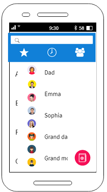

# Sharing-Code

Se trata de una red social para programadores que permite compartir trabajos y experiencias con otros compañeros de profesión.

## Diagrama de Flujo

#### Prototipo de alta fidelidad.

Para nuestro prototipo utilizamos mockflow.

* Testear el prototipo con usuarios.
* Asegurarte de que la implementación en código siga los lineamientos del
  diseño.
* Hacer sesiones de testing con el producto en HTML.

#### Prototipo de alta fidelidad.

Para nuestro prototipo utilizamos mockflow e invision.

t[Liga](https://projects.invisionapp.com/d/main#/console/14995962/311812131/preview)

