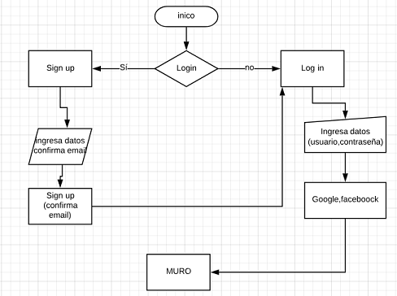
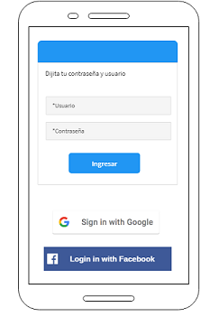
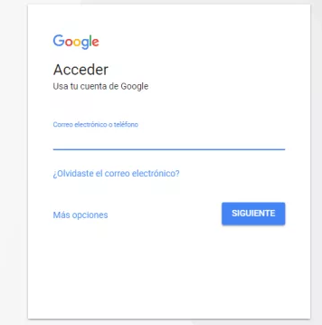
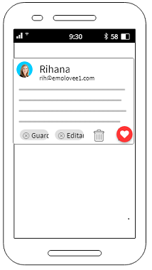
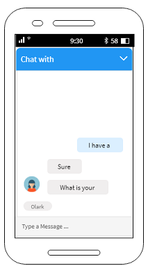

# Sharing-Code

Se trata de una red social para programadores que permite compartir trabajos y experiencias con otros compañeros de profesión.

## Diagrama de Flujo

## Instalación

Para poder interactuar con la red social Sharing-Code es necesario:
* Acceder a la siguiente liga: [link](https://dileyra.github.io/red-social-angular/register)
* Abrir la terminal e instalar npm: npm install
* Instalar Angular CLI: npm install -g @angular/cli
* Registrarte y listo ahora puedes compartir tú conocimiento en cuanto a código con toda una red de programadores…EXCELENTE!!!...

## Preámbulo

Instagram, Snapchat, Twitter, Facebook, Twitch, Linkedin, etc. Las redes
sociales han invadido nuestras vidas. Las amamos u odiamos, y muchos no podemos
vivir sin ellas.

## Introducción

Una emprendedora nos ha encargado crear una red social. No nos da mucho detalle
sobre qué tipo de red social quiere, sólo nos dice que creemos la mejor que
podamos, y que luego la convenzamos de lanzarla al mercado. Nos da ciertos temas
en los que le gustaría invertir:

## Introducción a las redes sociales

“Las Redes son formas de interacción social, definida como un intercambio dinámico entre personas, grupos e instituciones en contextos de complejidad. Un sistema abierto y en construcción permanente que involucra a conjuntos que se identifican en las mismas necesidades y problemáticas y que se organizan para potenciar sus recursos.

Una sociedad fragmentada en minorías aisladas, discriminadas, que ha desvitalizado sus redes vinculares, con ciudadanos carentes de protagonismo en procesos transformadores, se condena a una democracia restringida. La intervención en red es un intento reflexivo y organizador de esas interacciones e intercambios, donde el sujeto se funda a sí mismo diferenciándose de otros.”

No difiere lo dicho sobre una red grupal y lo que sucede a nivel subjetivo en Internet, al menos en las que se dedican a propiciar contactos afectivos nuevos como lo son las redes de búsqueda de pareja, amistad o compartir intereses sin fines de lucro.

En las redes sociales en Internet tenemos la posibilidad de interactuar con otras personas aunque no las conozcamos, el sistema es abierto y se va construyendo obviamente con lo que cada suscripto a la red aporta, cada nuevo miembro que ingresa transforma al grupo en otro nuevo. La red no es lo mismo si uno de sus miembros deja de ser parte.

Intervenir en una red social empieza por hallar allí otros con quienes compartir nuestros intereses, preocupaciones o necesidades y aunque no sucediera más que eso, eso mismo ya es mucho porque rompe el aislamiento que suele aquejar a la gran mayoría de las personas, lo cual suele manifestarse en retraimiento y otras veces en excesiva vida social sin afectos comprometidos.

Las redes sociales en Internet suelen posibilitar que pluridad y comunidad se conjuguen y allí quizás esté gran parte de toda la energía que le da vida a los grupos humanos que conforman esas redes. Las redes sociales dan al anónimo popularidad, al discriminado integración, al diferente igualdad, al malhumorado educación y así muchas cosas más.

La fuerza del grupo permite sobre el individuo cambios que de otra manera podrían ser difíciles y genera nuevos vínculos afectivos y de negocios.

Las herramientas que proporcionan en general las redes sociales en Internet son:

* Actualización automática de la libreta de direcciones
* Perfiles visibles
* Capacidad de crear nuevos enlaces mediante servicios de presentación y otras maneras de conexión social en línea.

## ¿Qué idiomas se hablan en redes sociales?

Twitter, LinkedIn o Google+ son algunas de las redes sociales en las que tanto un usuario como una empresa pueden estar presentes. Uno de los puntos a destacar de la expansión del social media a nivel mundial, y de gran interés para las marcas, es el idioma que los usuarios utilizan en cada una de las redes. Pero antes de entrar en ello, veamos, a grandes rasgos, el panorama actual de las redes sociales.

* El panorama actual de las redes sociales
Según el estudio anual realizado por IAB SPAIN, si hablamos del uso de redes sociales, Facebook es la red social por excelencia y la que ha conseguido captar a más usuarios (91%), seguida de WhatsApp (89%), YouTube (71%) y Twitter (50%). Por su lado, Instagram, se convierte en la red con la mayor subida de usuarios en el último año, dejando atrás a LinkedIn. Twitter y Google+ han tenido bajadas en cuanto al uso pero no destacables.

Entre las principales redes, Google+ está a la cola junto a Pinterest, que sube un 14%, con respecto al año pasado. Como vemos, Google+ no tiene un uso habitual entre los usuarios, dado que su uso principal es mantener posicionamiento en el buscador Google.

IMAGEN

### ¿Qué uso le dan los usuarios a las redes sociales?

Uso principal en redes sociales: chatear, enviar mensajes, ver qué hacen tus contactos, entre otros.
Seguimiento de marcas: el 83% de los usuarios sigue a alguna marca y más de la mitad de los usuarios se declara influido en sus decisiones de compra.
E-commerce y redes sociales: un 53% de los usuarios busca productos a través de las redes sociales. Facebook es el medio más usado para esto (64%).
Tipo de contenido: las fotos son el contenido que más se publica en redes sociales. Instagram es la red que mejor responde a esta tendencia y se ha reflejado en un aumento de su popularidad.

### ¿Cómo se conectan los usuarios?

 Un 91% de los usuarios accede a las redes sociales a través de su móvil. Comparando el acceso por dispositivos, los españoles prefieren acceder a las redes sociales desde el móvil a partir de las 4 de la tarde, mientras que la tablet es más nocturna y se utiliza más a partir de las 8:30. Facebook, YouTube o Twitter son las redes sociales más utilizadas tanto desde móviles como desde tablets.

### ¿Qué deben hacer las marcas?

La presencia en redes resulta relevante para crear un vínculo con los usuarios y obtener su confianza. Ante esta situación, las marcas se deben tomar muy en serio su comunicación online y para ello deben:

Mejorar en la creación de contenido, que pueda ser usado en múltiples canales, no solo en Facebook.
* Colaborar con influencers, puesto que es una gran manera de fomentar el engagement con los usuarios.
* Identificar qué es lo que motiva y emociona a sus clientes.
* Adaptar sus contenidos a dispositivos móviles.
* Ya hemos visto qué redes sociales son las más relevantes en nuestro país y qué uso dan los usuarios a estas.

### ¿pero en qué idiomas se habla en las redes?

Los idiomas más hablados en redes sociales
Facebook es la red social en la que más idiomas se hablan con un total de 70. Por el contrario, LinkedIn cuenta tan solo con 17 idiomas.

El inglés, al ser considerado idioma global, lidera la lista de los idiomas más hablados en las redes sociales e Internet. En Internet, más del 50% de los sitios están en inglés. El Instituto Cervantes realizó un estudio en el que se concluyó que en Twitter cerca de 241 millones de usuarios hablan inglés y el 78% de ellos lo hablan como su segunda lengua.

El mismo estudio constata que el segundo idioma más hablado es el chino, seguido del español con un 7,6%, un dato sorprendente ya que este último cuenta con un mayor número de hablantes en el mundo. Aun así, cabe destacar que en Facebook y Twitter el español se coloca en segunda posición, por detrás del inglés, en el ranking de los idiomas más hablados.
Además, en determinados lugares del mundo, como en el caso de Nueva York, el español, después del inglés, es el idioma más utilizado en la red Twitter.

Además, en determinados lugares del mundo, como en el caso de Nueva York, el español, después del inglés, es el idioma más utilizado en la red Twitter.

* Hacer un _benchamark_ de las principales redes sociales.
* Hacer al menos 2 o 3 entrevistas con usuarios.

__BENCHMARK COMPARATIVA ENTRE REDES SOCIALES__

|   |Facebook   |  Twiter | Instagram  |Sharing Code   |
|---|---|---|---|---|
|  Logeo con usuario y contraseña | x | x | x | x |
|  Logeo mediante otras redes sociales|   |   | x | x |
|  Agregar amigos/seguir | x | x | x | x |
|  Realizar comentarios | x | x | x | x |
|  Perfil | x | x | x | x |
|  Subir fotos | x | x | x | x |
|  Me gusta | x | x | x | x |
|  Creación de grupos | x | x |   | x |
|  Subir documentos |   |   |   |  x |
|  Eliminar comentarios | x | x | x | x |
|  Editar comentarios | x | x | x | x |
|  Otros idiomas | x | x | x | x |

__BENCHMARK COMPARATIVA REDES SOCIALES SOLO PARA PROGRAMADORES__

|   |  Sharing code |  Notas Web | Desarrollo Web  | Domestika  | Coder Wall  | Better Codes  |
|---|---|---|---|---|---|---|
| Compartir  | x |   |   |   |   |   |
| Logueo con otras redes sociales  | x |   |   |   |   |   |
| Subir y descargar recursos   | x | x |   | x |   |   |
| Realizar, editar y eliminar comentarios  | x |   | x |   | x | x |
| Reaccióm me gusta | x |   |   |   |   |   |
| Bolsa de trabajo  |   | x |   | x |   |   |
| Contador de usuarios  |   | x |   |   |   |   |
| Cuenta con foros  |   |   | x | x |   |   |
| Compartir   |   |   |   |   | x | x |
| Enlazarse con otras comunidades  |   |   |   |   | x |   |
| Otros idiomas  |   |   |   |   |   |   |

#### Prototipo de alta fidelidad.

Para nuestro prototipo utilizamos mockflow e invision.

## Prototipo de alta fidelidad.

A continuación se muestra el prototipo de alta fidelidad para nuestro proyecto:

Vista del login:

Vista del login con Google:

Vista del muro, donde el usuario podra realizar publicaciones, editar, eliminar y dar like:

Vista donde el usuario podra comentar publicaciones de otros usuarios: 

